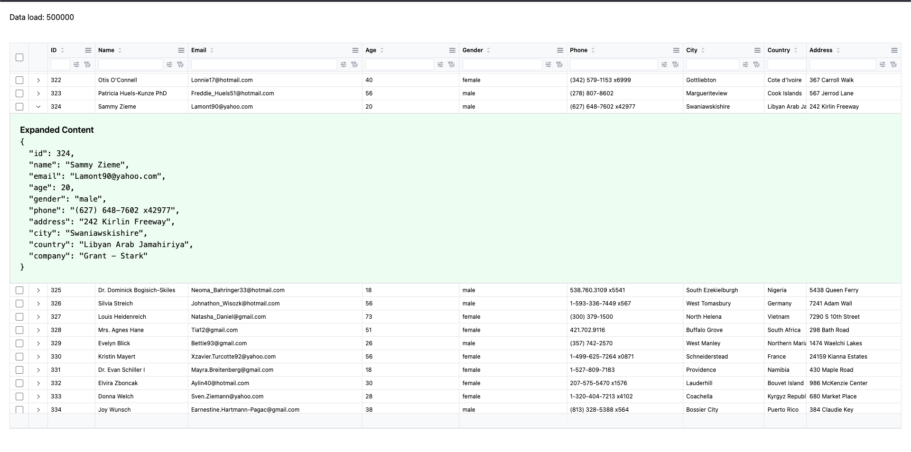

# React Virtualized Table 📊

A high-performance virtual table component built with React and TanStack Virtual for handling large datasets
efficiently.



## Tech Stack 🛠️

### Runtime & Package Manager
- **Node.js** - 20.16.0
- **pnpm** - 9.7.0

### Core Framework
- **React** - 19.1.0
- **TypeScript** - 5.8.3

### Virtualization & Performance
- **TanStack Virtual** - 3.13.10 (Virtualization engine)
- **react-virtualized-auto-sizer** - 1.0.26 (Auto-sizing)
- **react-scroll-sync** - 1.0.2 (Scroll synchronization)

### Styling & UI
- **Tailwind CSS** - 4.1.10
- **clsx** - 2.1.1 (Conditional styling)

### Build Tools
- **Vite** - 6.3.5 (Build tool and dev server)
- **ESLint** - 9.25.0 (Code linting)

### State Management
- **use-context-selector** - 2.0.0 (Optimized context)

## Getting Started 🚀

### Prerequisites

Make sure you have the following installed:
- Node.js 20.16.0 or higher
- pnpm 9.7.0 or higher

### Installation & Running

```bash
# Clone the repository
git clone <repository-url>
cd react-virtualized-table

# Install dependencies
pnpm install

# Start development server
pnpm dev
```

The application will be available at `http://localhost:3002`

### Available Scripts

```bash
# Development
pnpm dev          # Start development server

# Build
pnpm build        # Build for production

# Code Quality
pnpm lint         # Run ESLint

# Preview
pnpm preview      # Preview production build
```

## Features

### Core Features

- **Virtualized Rendering** - Efficiently handles large datasets (500K+ rows)
- **Sticky Headers** - Headers remain visible while scrolling
- **Column Resizing** - Drag to resize columns with visual feedback
- **Freeze Columns** - Pin columns to left or right
- **Auto Stretch** - Automatically adjust column widths
- **Custom Renderers** - Render custom JSX content in cells

### Filtering & Sorting

- **Column Sorting** - Click headers to sort data
- **Search Filters** - Real-time search across columns
- **Selection Filters** - Filter by predefined options
- **Advanced Filters** - Complex filtering with multiple conditions

### Row Interactions

- **Row Selection** - Single/multiple row selection with checkboxes
- **Row Expansion** - Expand rows to show detailed content
- **Click Events** - Handle single, double, and right-click events
- **Custom Actions** - Add action buttons to rows

### Performance

- **Scroll Bottom Detection** - Efficient infinite scroll support
- **Optimized Rendering** - Only renders visible rows and columns
- **Low INP** - Optimized for smooth user interactions

## Usage 📖

### Basic Example

```tsx
import { VirtualTable } from 'react-virtualized-table';

const data = [
  { id: 1, name: 'John Doe', email: 'john@example.com', age: 30 },
  { id: 2, name: 'Jane Smith', email: 'jane@example.com', age: 25 },
  // ... more data
];

const columns = [
  { key: 'id', caption: 'ID', width: 80 },
  { key: 'name', caption: 'Name', width: 200 },
  { key: 'email', caption: 'Email', width: 250 },
  { key: 'age', caption: 'Age', width: 100 },
];

function App() {
  return (
    <VirtualTable
      rowKey='id'
      data={data}
      headers={columns}
      onScrollTouchBottom={() => console.log('Load more data')}
      onClickRow={(row) => console.log('Row clicked:', row)}
    />
  );
}
```

### Advanced Example

```tsx
<VirtualTable
  rowKey='id'
  data={data}
  headers={columns}
  headerMode='double'
  useFooter={true}
  useServerFilter={{
    sort: true,
    search: true,
    selection: true,
    advance: true,
  }}
  onScrollTouchBottom={() => loadMoreData()}
  onClickRow={(row) => selectRow(row)}
  onDoubleClickRow={(row) => editRow(row)}
  onRightClickRow={(row, position) => showContextMenu(row, position)}
  onChangeFilter={{
    sort: (key, order) => handleSort(key, order),
    search: (filters) => handleSearch(filters),
    selection: (filters) => handleSelection(filters),
    advance: (filters) => handleAdvance(filters),
  }}
  onRenderExpandedContent={(row) => (
    <div className='p-4 bg-gray-50'>
      <h3>Details for {row.name}</h3>
      <pre>{JSON.stringify(row, null, 2)}</pre>
    </div>
  )}
/>
```

## Props API 📋

### Required Props

- `rowKey` - Key field for each row (string or function)
- `data` - Array of data objects
- `headers` - Array of column definitions
- `onScrollTouchBottom` - Callback when scroll reaches bottom

### Optional Props

- `headerMode` - 'single' | 'double' (default: 'double')
- `useFooter` - Show footer (default: false)
- `useAutoSizer` - Auto-size container (default: false)
- `isLoading` - Show loading indicator (default: false)
- `rowHeight` - Height of each row (default: 40)
- `headerHeight` - Height of header (default: 40)
- `filterHeight` - Height of filter row (default: 40)
- `footerHeight` - Height of footer (default: 40)

### Event Handlers

- `onClickRow` - Row click handler
- `onDoubleClickRow` - Row double-click handler
- `onRightClickRow` - Row right-click handler
- `onChangeCheckboxRowSelection` - Checkbox selection handler
- `onRenderExpandedContent` - Custom expanded content renderer
- `onChangeFilter` - Filter change handlers